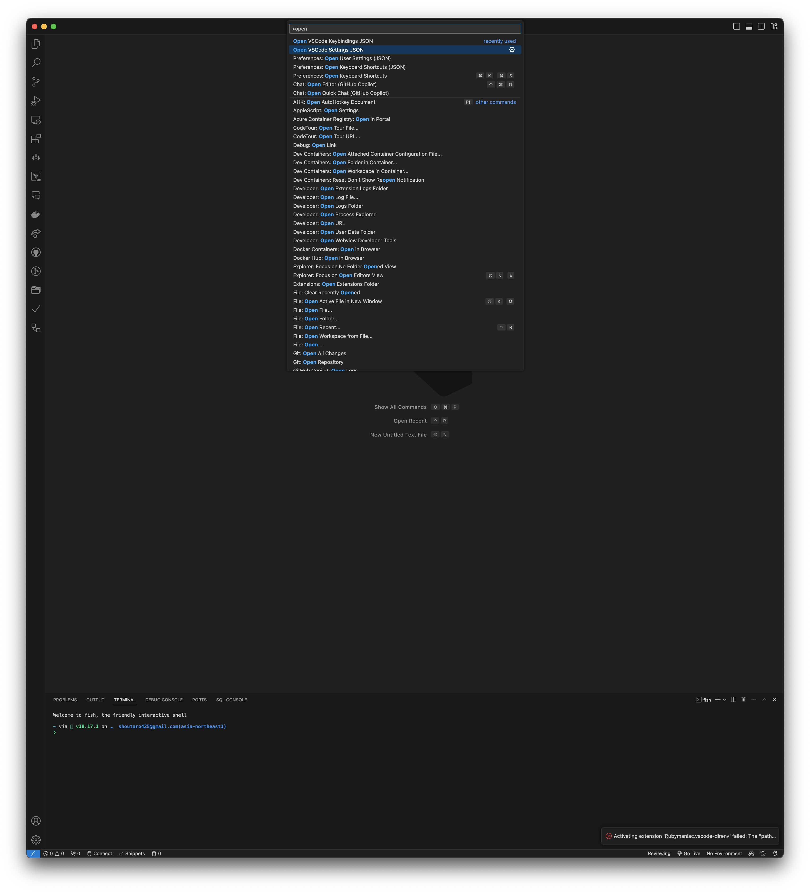
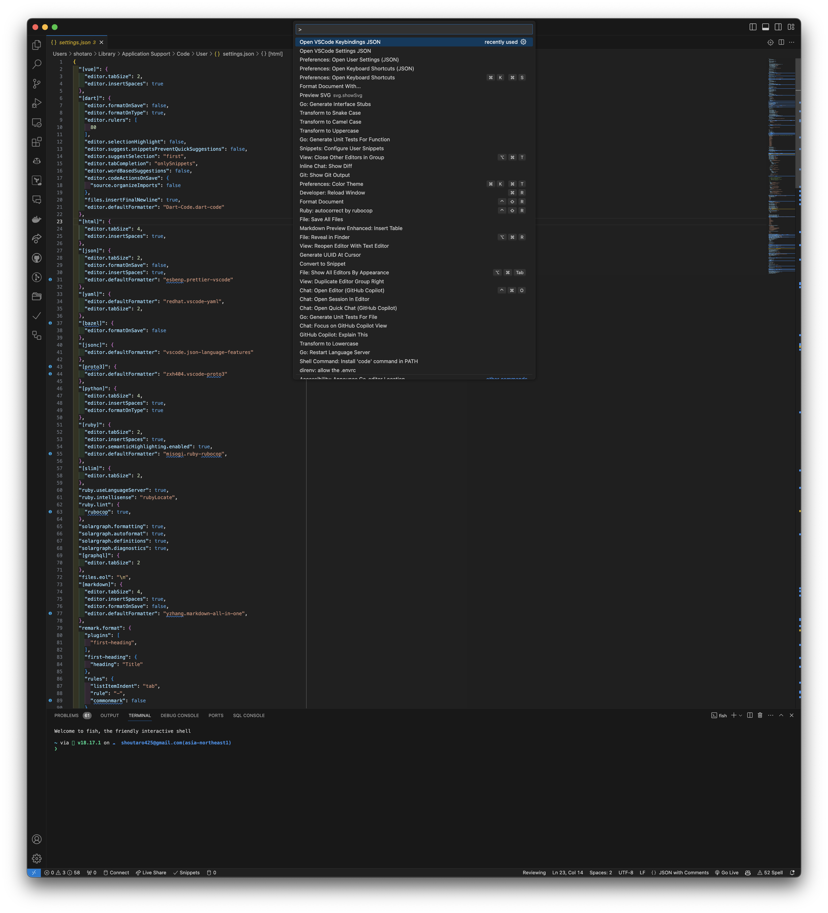

# open-vscode-settings README

Open vscode settings files from other IDE such as Cursor.

## Features

You can use this features from command palette.

Open settings.json of VSCode

Open keybindings.json of VSCode

